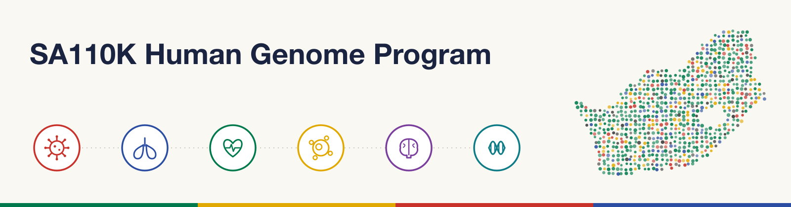

# SA110K-HGP Pilot: South African 110,000 Human Genome Program (Pilot Phase)

The **South African 110,000 Human Genome Program (SA110K-HGP)** is a national
initiative led by the **South African Medical Research Council (SAMRC)** in
partnership with the **Department of Science, Technology, and Innovation (DSTI)**.

This repository hosts the public-facing resources for the **pilot phase**, which
will sequence **10,000 whole genomes at 30x coverage over two years** from
existing longitudinal patient cohorts across South Africa.

**Website:** _Construction in progress_
---

## About the Pilot

The pilot will not blindly sequence the genomes, instead, it aims to build a **clinical
genomics ecosystem** for South Africa. By embedding whole genome sequencing (WGS)
into existing clinical studies and trials, the pilot will test how genomic data
can improve care and research in African populations, and will validate
protocols, establish cost structures, optimise workflows, and demonstrate
feasibility for nationwide scale-up toward a 100K national population genome program.

## Objectives

- Identify diverse patient cohorts for WGS at 30x coverage
- Use genomic data to address critical gaps in disease understanding and therapeutic response
- Integrate genomic insights into clinical trial studies for improved patient outcomes
- Build national genomic resources that inform a scalable workflow for the full National Genome Program
- Contribute data to a National Genomics Archive for enhanced analytics and population-based impact
- Promote tertiary analyses that extract actionable insights from genomic data

## How It Works

- **Contributing cohorts:** 10 established South African longitudinal cohorts
  (500–2,500 blood-derived samples each), selected through a competitive RFA
  process reviewed by an independent panel of genomic and clinical experts
- **Sequencing:** Centralised WGS at 30x coverage on **Illumina and MGI**
  platforms at accredited South African sequencing centres
- **Data processing:** Standardised, centralised bioinformatics pipelines
- **Data storage:** De-identified genomic data (FASTQ, BAM/CRAM, VCF) deposited
  in the **South African National Genomics Archive**, with associated metadata
  in a separate **Phenotype Data Registry**

## Data Governance

- No participant or genomic data is stored in this repository
- All data is de-identified and held in the National Genomics Archive under
  controlled access mechanisms
- All cohorts hold ethical approval from a registered South African Human
  Research Ethics Committee, with valid participant consent for genetic
  studies and data sharing
- Data management follows **FAIR principles** (Findable, Accessible,
  Interoperable, Reusable)
- Cohort PIs retain primary access rights and contribute to downstream use
  governance via data access committees

## Resources

| Resource | Where |
|---|---|
| Harmonized core phenotype data dictionary | *(coming soon)* |
| Analysis pipelines | *(coming soon)* |
| Protocols and SOPs | *(coming soon)* |
| Publications and outputs | *(coming soon)* |

## Roadmap

- [x] RFA released and cohort applications reviewed (2025)
- [x] Pilot cohorts selected and onboarded
- [ ] Phenotype variable harmonization across the 10 cohorts
- [ ] Sample logistics, DNA extraction, and WGS at 30x
- [ ] Centralised data processing and deposit into the National Genomics Archive
- [ ] Genotype-phenotype association studies and tertiary analyses
- [ ] Pilot evaluation and scale-up framework for the national program

## Follow the Program

- Star and Watch this repository for updates
- Subscribe to releases: `https://github.com/sa110k/sa10k-pilot/releases.atom`

## Contact

**Nganea Nangammbi** — Project Manager, South African 110K Human Genome Program
Email: 10K-Genome_Pilot@mrc.ac.za

Issued by the SAMRC in partnership with the DSTI.

## License

Documentation is licensed under [CC-BY-4.0](LICENSE). Code, where present, under MIT.
